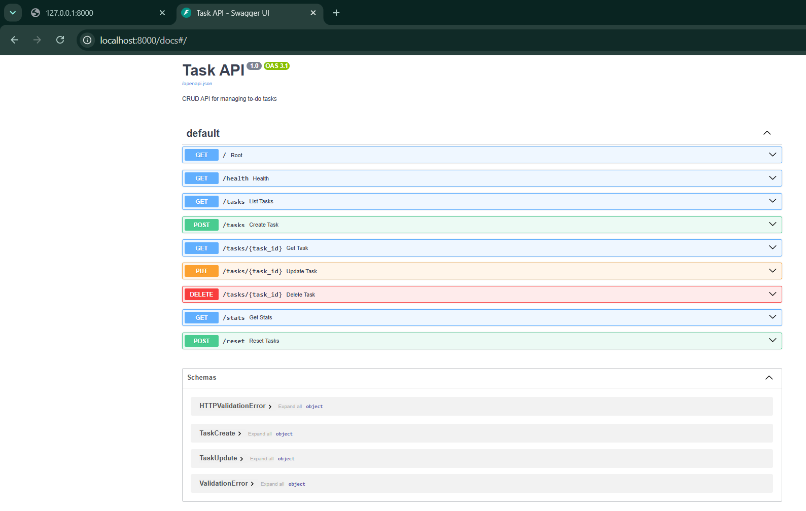

# Task API

A CRUD REST API for managing to-do tasks, built with FastAPI (Python).  
Built as Week 2 Assignment A1 of the FlyRank AI Fluency Internship.

## Run locally (Windows PowerShell)

```powershell
python -m venv venv
.\venv\Scripts\Activate.ps1
pip install -r requirements.txt
uvicorn main:app --reload
```

- API: `http://localhost:8000`
- Swagger UI: `http://localhost:8000/docs`

## Endpoints

| Method | Path | Description | Status codes |
|--------|------|-------------|--------------|
| GET | `/` | API info | 200 |
| GET | `/health` | Health check | 200 |
| GET | `/tasks` | List all tasks | 200 |
| GET | `/tasks/{id}` | Get one task | 200, 404 |
| POST | `/tasks` | Create a task | 201, 422 |
| PUT | `/tasks/{id}` | Update a task | 200, 400, 404 |
| DELETE | `/tasks/{id}` | Delete a task | 204, 404 |
| GET | `/stats` | Task statistics | 200 |
| POST | `/reset` | Reset to seed data | 200 |

## Testing with curl.exe on Windows

PowerShell corrupts JSON quoting when passed inline to `curl.exe`. The reliable pattern is to write the JSON body to a file first, then pass it with `-d "@file.json"`.

```powershell
# Create the body file
[System.IO.File]::WriteAllText("$PWD\create.json", '{"title":"Buy milk"}')

# Send the request
curl.exe -i -X POST http://localhost:8000/tasks `
  -H "Content-Type: application/json" `
  -d "@create.json"
```

Example response:

```
HTTP/1.1 201 Created
date: Sat, 18 Jul 2026 17:50:46 GMT
server: uvicorn
content-length: 43
content-type: application/json

{"id":4,"title":"Final check","done":false}
```

## Data model

```json
{
  "id": 1,
  "title": "Buy groceries",
  "done": false
}
```

Tasks are stored in memory only. Restarting the server resets all tasks to the three seed tasks. This is intentional for Week 2 — persistence via a database is added in Week 3.

## Swagger UI



## Mortality experiment

After creating several tasks and restarting the server, all created tasks disappeared — only the three seed tasks remained. Python lists live in RAM: when the process exits, that memory is freed. A database writes state to disk so it survives restarts — which is the entire reason Week 3 introduces one.

## AI vs Me

I gave Claude a prompt written from memory (no peeking at my code or the assignment brief) and compared its FastAPI output against my hand-built version.

### My prompt

```
Build a REST API using Python FastAPI

Requirements:
Language: Python
Framework: FastAPI

Endpoints:
- GET /            returns API info
- GET /health      confirms API is running
- GET /tasks       list every task
- GET /tasks/{id}  returns specific task
- POST /tasks      add new task
- PUT /tasks/{id}  update task
- DELETE /tasks/{id} remove task

Request body for create: {"title": "Buy milk"}
Request body for update: {"title": "Buy bread", "done": true}

Task object shape:
  { "id": ..., "title": ..., "done": ... }

Success status codes:
- GET /            200 OK
- GET /health      200 OK
- GET /tasks       200 OK
- GET /tasks/{id}  200 OK
- POST /tasks      201 Created
- PUT /tasks/{id}  200 OK
- DELETE /tasks/{id} 204 No Content

Failure status codes:
- GET /tasks/{id}       404 Not Found
- POST /tasks           400 Bad Request
- PUT /tasks/{id}       400 Bad Request
- DELETE /tasks/{id}    404 Not Found

Validation: title must exist and cannot be empty.
Storage: in-memory Python list. No database.
Swagger UI required.
```

### Test results comparison

| Request | Mine (port 8000) | AI (port 8001) | Match |
|---|---|---|---|
| GET /health | 200 | 200 | ✅ |
| GET /tasks (fresh start) | 200 with 3 seed tasks | 200 with `[]` | ⚠️ |
| POST /tasks (valid) | 201 | 201 | ✅ |
| POST /tasks (empty body) | 422 | 400 | ⚠️ |
| GET /tasks/99 | 404 | 404 | ✅ |
| PUT /tasks/1 (full body) | 200 | 200 | ✅ |
| **PUT /tasks/1 (partial: `{"done": true}`)** | **200** | **400 — "title required"** | ❌ |
| PUT /tasks/1 (empty body) | 400 | 400 | ✅ |
| DELETE /tasks/1 | 204 | 204 | ✅ |
| GET /tasks/1 after delete | 404 | 404 | ✅ |

### Three concrete differences

**1. PUT semantics — partial vs full update (real bug in the AI version)**

My version treats PUT as a partial update — both `title` and `done` are optional, and only the fields present in the body get changed. The AI made `title` a required field on every PUT, so sending `{"done": true}` to mark a task complete returns `400 Bad Request`. That is the most common real-world PUT operation on a to-do API and the AI version cannot handle it. This is technically closer to the HTTP spec (PUT means "replace"; PATCH means "partial update"), but for a simple task API, partial-update PUT is the intuitive behaviour — and my prompt never said which one I wanted.

**2. Global 422 → 400 override**

The AI added a custom exception handler that converts every Pydantic validation error (default 422) into 400 across the entire API. This literally matches what my prompt asked for, but it is aggressive: any future validation failure anywhere will also return 400, not just on POST/PUT. My version keeps the default 422 for Pydantic errors and only uses a manual 400 for the specific case of "PUT body has neither `title` nor `done`". Both are defensible; the AI's is more literal, mine is more RFC-compliant.

**3. Empty seed data**

The AI starts with an empty list. My version pre-loads three example tasks. My prompt never mentioned seed data, so the AI made a reasonable default choice — but the consequence is that on a fresh clone of the AI version, `GET /tasks/1` returns 404, which is confusing for someone opening the API for the first time.

### What the AI did better

The AI's error format for validation failures is more informative than mine — it includes the exact field name that failed (`"loc":["body","title"]`) rather than a plain string message. It also used `response_model=Task` on every route, which enforces the response shape at runtime and generates cleaner Swagger docs. I know why both of these work and would adopt them in production code.

### What my prompt failed to specify

- **PUT semantics** — I did not say whether PUT is a full replace or a partial update. The AI chose "full replace" and introduced the partial-update bug above.
- **Seed data** — I did not say whether the list should start empty or pre-loaded.
- **Error body shape** — I did not say what an error response should look like (`{"error": ...}` vs `{"detail": ...}` vs something else). The AI picked FastAPI's default.
- **Response body for each endpoint** — I specified request bodies but never said what each endpoint returns. The AI picked reasonable defaults.
- **DELETE validation** — I wrote "DELETE /tasks/{id}: 400 Bad Request" which was a mistake in my prompt. The AI correctly ignored it and returned 404 for a missing id. Good AI, bad spec.
- **ID generation** — I did not say the ID should auto-increment. The AI chose auto-increment starting at 1.

### The rematch

If I rewrote the prompt, I would add: "PUT is a partial update — both title and done are optional; only send the fields you want to change." That single line would eliminate the biggest bug in the AI's version.

### The lesson

The AI's output was exactly as good as my specification. Every place my prompt was vague, the AI made a silent decision — and only because I had built the API by hand first could I see which of those decisions were fine, which were technically correct but bad UX, and which were outright bugs. This is the review skill I'll need for every AI-generated PR I look at in production.

*(Filled in during Stage 7 bonus)*
