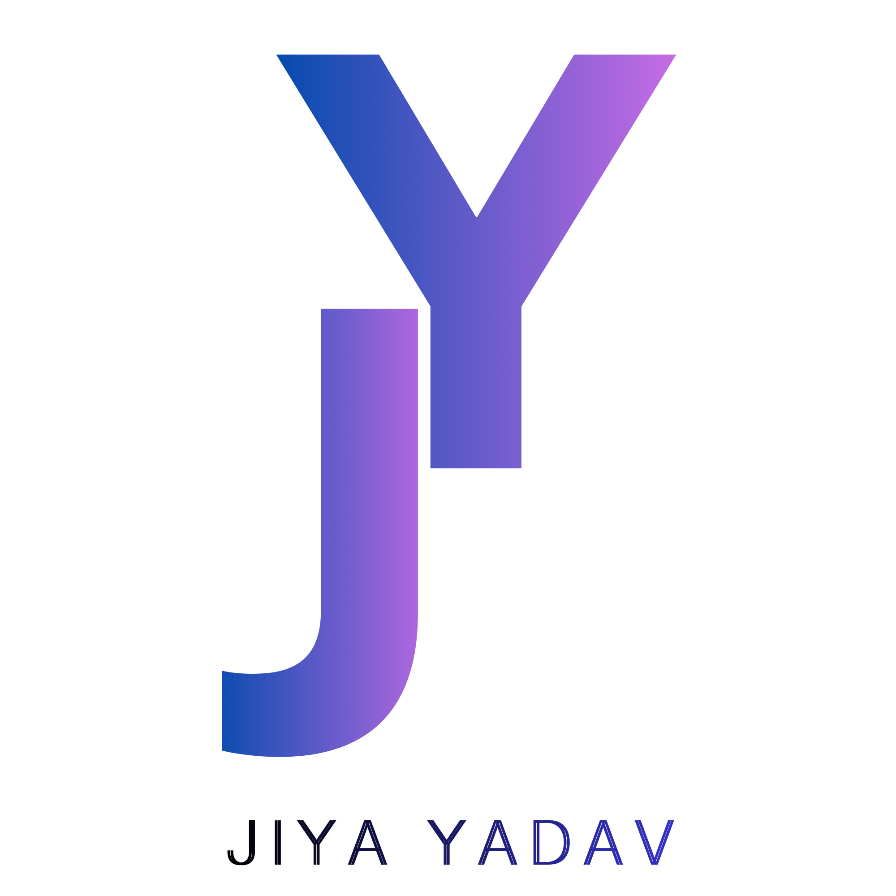

<div align="center">



# Identity Kit — Jiya Yadav

### `Decide once. Apply everywhere.`

**Week 2 deliverable** · FlyRank AI Fluency · Foundations Phase

[](https://jiya-yadav.netlify.app/)
[](https://jiya-ydv.github.io/jiya-yadav.github.io/)
[](https://aifluency.flyrank.ai/)

</div>

---

## 📖 What This Is

A one-page visual identity kit that locks in the fonts, colors, logo, and mood used across my portfolio, case studies, and every future asset.

The idea: **decide the small things once**, so every new page inherits them without re-thinking. No more "which font was I using again?" or "was that purple `#A855F7` or `#8B5CF6`?"

This kit is the single source of truth for the entire `jiya.dev` visual system.

---

## 🎨 The System

<table>
<tr>
<td width="50%" valign="top">

### Typography

| Role | Font | Weight |
|------|------|:---:|
| Headings | **Inter** | 700 / 800 |
| Body | **Inter** | 400 |
| Code / labels | **JetBrains Mono** | 500 |

Loaded from Google Fonts — no custom hosting.

</td>
<td width="50%" valign="top">

### Palette

| Role | Hex | Sample |
|------|-----|:---:|
| Background | `#0A0A0F` | ⬛ |
| Text | `#E5E7EB` | ⬜ |
| Primary | `#A855F7` | 🟪 |
| Accent | `#06B6D4` | 🟦 |

Four colors. Nothing more.

</td>
</tr>
</table>

### Signature Gradient
Used on the name in the hero, section headings, and CTA glows.
```css
background: linear-gradient(135deg, #A855F7 0%, #06B6D4 100%);
```
## The Logo 🖋️
JY Monogram — indigo → violet gradient with "JIYA YADAV" wordmark beneath.

Full mark: nav header, identity kit hero, OG share card
Cropped mark: browser favicon (32×32, 64×64, SVG)
Always sits on #0A0A0F background — never white boxed

## Repo Contents 📁 
```
identity-kit/
├── index.html         # Full identity kit page (mobile-responsive)
├── jiya-logo.png      # JY monogram (used as favicon + hero)
└── README.md          # you are here
```

## Tech 🛠️
Plain HTML + CSS, no framework
Google Fonts for Inter + JetBrains Mono
CSS Grid for the responsive card layout
Mobile breakpoints at 900px, 640px, 380px
Deployed via Netlify (drag-and-drop, no build step)

## Deploy Your Own Version 🚀
1. Clone: git clone https://github.com/JIYA-YDV/flyrank-internship-tracker/tree/main/week_3/identity-kit
2. Edit index.html — swap fonts, palette, logo, style note
3. Deploy: Drag the folder onto Netlify → done

<div align="center">
Built for FlyRank AI Fluency 
</div>
