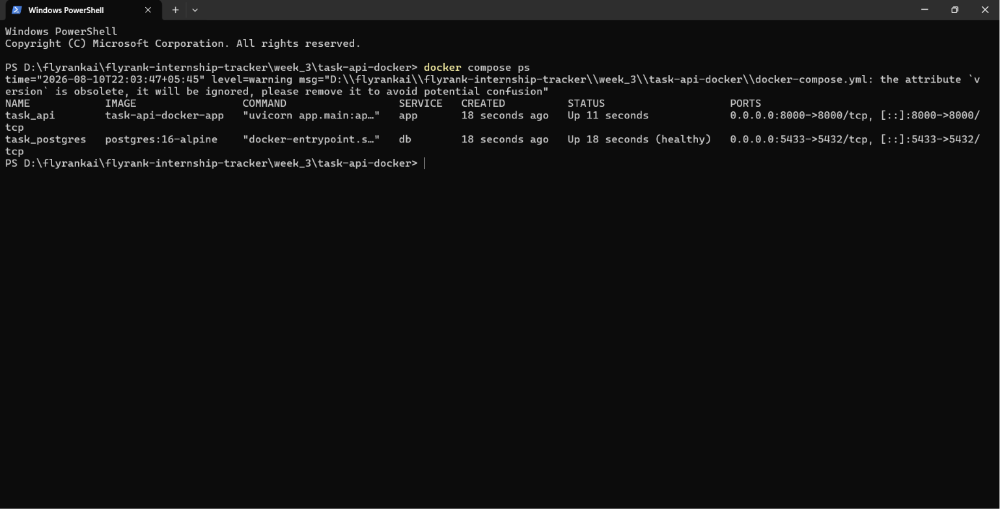
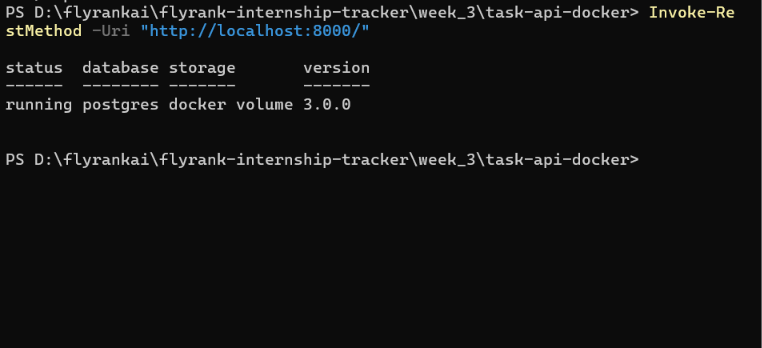
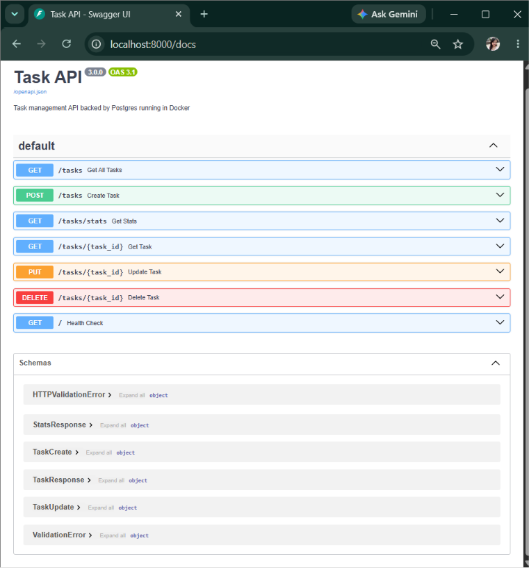
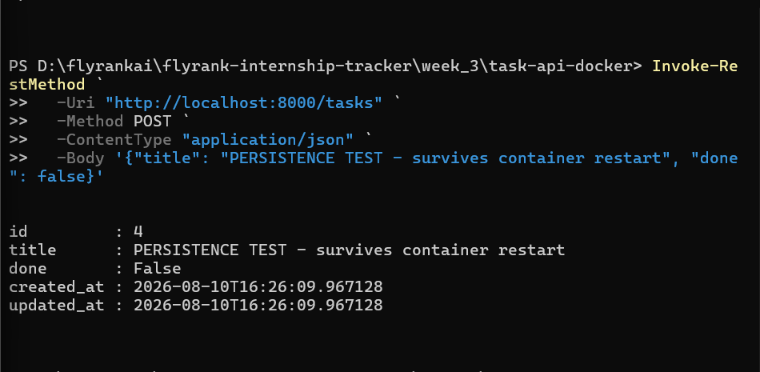
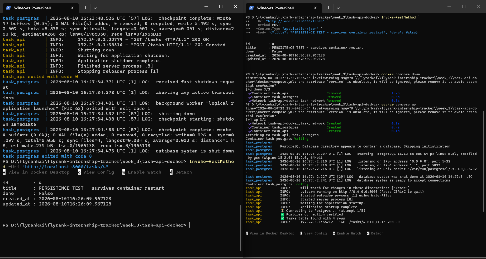
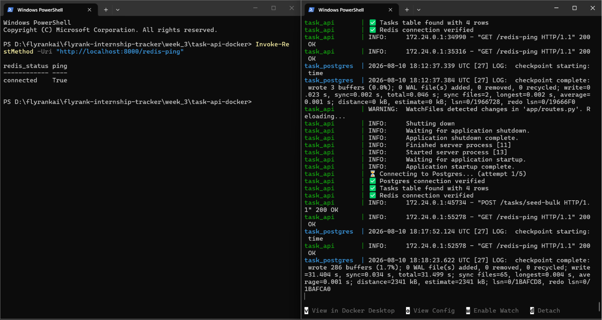
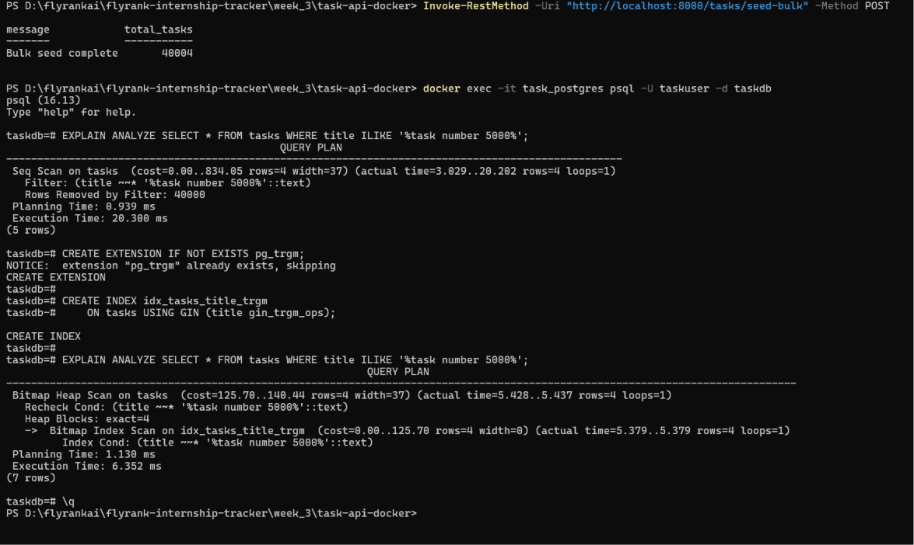

# Task API — Postgres + Docker (BE-04)

A FastAPI Task Management API backed by Postgres running in Docker.
The entire stack starts with one command: `docker compose up`.

Assignment: **BE-04 — Containerize your stack** (Week 3, Assignment 3)

---

## What Changed from A2

The A2 assignment used SQLite (a local file).
This assignment replaces SQLite with Postgres running in a Docker container.

| File | Changed? | What changed |
|------|----------|--------------|
| `database.py` | ✅ Yes | Postgres connection using psycopg2 instead of SQLite |
| `crud.py` | ✅ Yes | `%s` placeholders, `RETURNING *`, `ILIKE`, `COALESCE` for stats |
| `models.py` | ⚠️ Minor | `created_at` / `updated_at` changed from `str` to `datetime` because Postgres returns real timestamp objects |
| `routes.py` | ⚠️ Minor | Reordered routes so `/tasks/stats` is declared before `/tasks/{task_id}` (FastAPI matches routes top-down) |
| `main.py` | ⚠️ Minor | Import paths updated to `app.database` and `app.routes` due to new package structure |

**Honest summary:** the business logic in `routes.py` is identical to A2 (same functions, same status codes, same error handling). The only structural changes were the two type fixes above, which are direct consequences of moving from SQLite to Postgres. The architecture from A2 held up: swapping storage engines mostly changed only `database.py` and `crud.py`.

---

## Project Structure

```
task-api-docker/
├── app/
│   ├── __init__.py      ← makes app/ a Python package
│   ├── database.py      ← Postgres connection with retry logic
│   ├── models.py        ← Pydantic schemas
│   ├── crud.py          ← SQL query functions
│   ├── routes.py        ← FastAPI HTTP endpoints
│   └── main.py          ← app entry point + lifespan startup
├── sql/
│   └── init.sql         ← creates table and seeds data on first run
├── .env                 ← secret config (gitignored)
├── .env.example         ← config template (committed)
├── .gitignore
├── Dockerfile           ← builds the FastAPI app image
├── docker-compose.yml   ← runs app + database together
├── requirements.txt
├── DOCUMENTATION.md     ← full technical documentation
└── README.md
```

---

## Quick Start

**Requirements:** Docker Desktop must be installed and running.

```bash
# 1. Clone the repo
git clone https://github.com/YOUR_USERNAME/task-api-docker.git
cd task-api-docker

# 2. Create your .env file from the template
cp .env.example .env

# 3. Start everything with one command
docker compose up --build
```

The API is ready when you see:
```
task_api | ✅ Postgres connection verified
task_api | ✅ Tasks table found with 3 rows
task_api | INFO: Application startup complete.
```

Visit:
- **API:** http://localhost:8000
- **Interactive docs:** http://localhost:8000/docs

---

## About the Postgres Port (5433)

The `docker-compose.yml` maps Postgres to port **5433** on the host, not 5432:

```yaml
ports:
  - "5433:5432"
```

This is because I already had a local Windows Postgres service using 5432.
The app inside Docker still connects on port 5432 through the internal Docker network — the `db` hostname resolves to the container.

If you want to connect from a database GUI on your machine (like pgAdmin or TablePlus):
```
Host:     localhost
Port:     5433
User:     taskuser
Password: taskpassword
Database: taskdb
```

---

## Stop the Stack

```bash
# Stop (data is safe — volume kept)
docker compose down

# Stop AND delete all data (fresh start)
docker compose down -v
```

---

## API Endpoints

| Method | Path | Description | Status |
|--------|------|-------------|--------|
| GET | `/` | Health check | 200 |
| GET | `/tasks` | List all tasks (with optional filters) | 200 |
| GET | `/tasks/stats` | Task statistics | 200 |
| GET | `/tasks/{id}` | Get one task | 200 / 404 |
| POST | `/tasks` | Create a task | 201 |
| PUT | `/tasks/{id}` | Update a task | 200 / 404 |
| DELETE | `/tasks/{id}` | Delete a task | 200 / 404 |

### Optional query parameters for GET /tasks

| Parameter | Example | Effect |
|-----------|---------|--------|
| `search` | `?search=docker` | Filter by keyword (case-insensitive, uses Postgres `ILIKE`) |
| `done` | `?done=false` | Filter by completion status |
| `sort_alpha` | `?sort_alpha=true` | Sort A → Z by title |

---

## Example Requests

**PowerShell:**
```powershell
Invoke-RestMethod -Uri "http://localhost:8000/tasks" `
  -Method POST `
  -ContentType "application/json" `
  -Body '{"title": "Learn Docker", "done": false}'
```

**curl (Mac/Linux):**
```bash
curl -X POST http://localhost:8000/tasks \
  -H "Content-Type: application/json" \
  -d '{"title": "Learn Docker", "done": false}'
```

---

## Database Schema

```sql
CREATE TABLE tasks (
    id          SERIAL      PRIMARY KEY,
    title       TEXT        NOT NULL,
    done        BOOLEAN     NOT NULL  DEFAULT FALSE,
    created_at  TIMESTAMP   NOT NULL  DEFAULT NOW(),
    updated_at  TIMESTAMP   NOT NULL  DEFAULT NOW()
);
```

---

## Proving Persistence (Assignment Requirement)

The core promise of this assignment: **data survives a full container restart**.

**How I verified it:**

**Step 1 — Create a test row:**
```powershell
Invoke-RestMethod -Uri "http://localhost:8000/tasks" `
  -Method POST -ContentType "application/json" `
  -Body '{"title": "PERSISTENCE TEST — created before restart"}'
# Response: { "id": 6, ... }
```

**Step 2 — Stop the entire stack:**
```bash
docker compose down
# Both containers are removed
```

**Step 3 — Start it again:**
```bash
docker compose up
```

**Step 4 — Check the task is still there:**
```powershell
Invoke-RestMethod -Uri "http://localhost:8000/tasks/6"
# Response: { "id": 6, "title": "PERSISTENCE TEST...", ... }
```

**Why it works:**
Postgres stores its data in `/var/lib/postgresql/data` inside the container.
`docker-compose.yml` maps this to a Docker named volume (`postgres_data`).
`docker compose down` removes containers but does **not** remove named volumes.
When `docker compose up` runs again, the new container mounts the same volume, and Postgres finds all its data files exactly where it left them.

Only `docker compose down -v` (with the `-v` flag) actually deletes the volume.

---

## Bugs Fixed During Development

| Bug | Cause | Fix |
|-----|-------|-----|
| Port 5432 already allocated | Local Windows Postgres was running | Mapped host port to 5433 in compose |
| Cannot translate host name "db" | Network not ready when app started | Added explicit `task_network`, retry loop in `init_db()` |
| 500 on `GET /tasks` | Pydantic expected `str`, Postgres returned `datetime` | Changed `models.py` timestamps to `datetime` |
| 422 on `GET /tasks/stats` | `/tasks/{task_id}` matched first, parsed "stats" as int | Moved `/tasks/stats` above `/tasks/{task_id}` |
| `Decimal` in stats response | Postgres `SUM()` returns Decimal | Wrapped with `int()` and `COALESCE` for NULL safety |

---

## Git Commit History

```
commit 14 — docs: add README and technical documentation
commit 13 — fix: reorder routes so /tasks/stats matches before /tasks/{task_id}
commit 12 — fix: use datetime types for Postgres timestamps, cast SUM to int
commit 11 — fix: resolve port conflict and add retry logic for Docker networking
commit 10 — stage 8: update import paths for app package structure
commit 09 — stage 7: rewrite crud.py with Postgres SQL syntax
commit 08 — stage 6: replace SQLite connection with Postgres in database.py
commit 07 — stage 5: add docker-compose with postgres and app services
commit 06 — stage 4: add Dockerfile for FastAPI app container
commit 05 — stage 3: add SQL init file to create and seed tasks table
commit 04 — stage 2: add requirements with psycopg2 and python-dotenv
commit 03 — stage 1: add env config files
commit 02 — chore: added comprehensive .gitignore file for Python and Docker
commit 01 — project: initialize structure and copy A2 files
```

---

## Requirements Checklist

- [x] Postgres runs in Docker with a named volume
- [x] Whole stack starts with `docker compose up`
- [x] Connection string in `.env` (gitignored)
- [x] `.env.example` committed
- [x] Table created by `sql/init.sql`
- [x] Postgres repository replaced SQLite
- [x] Persistence proven across container restart
- [x] README documents everything honestly

---

---

## Screenshots / Evidence

### Docker Stack Running



### API Health Check



### Swagger API Documentation



### Persistence Before Restart



### Persistence After Restart



# After Redis and index stretches
### Redis Ping



### EXPLAIN ANALYZE — Before-After Index



## Author
Jiya Yadav
Built as part of the FlyRank AI Backend Engineering Internship, Week 3.