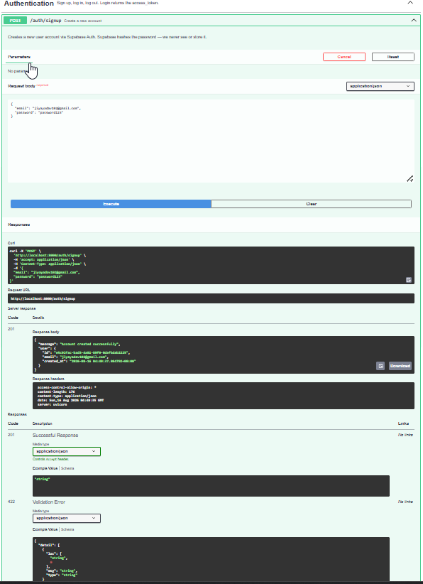
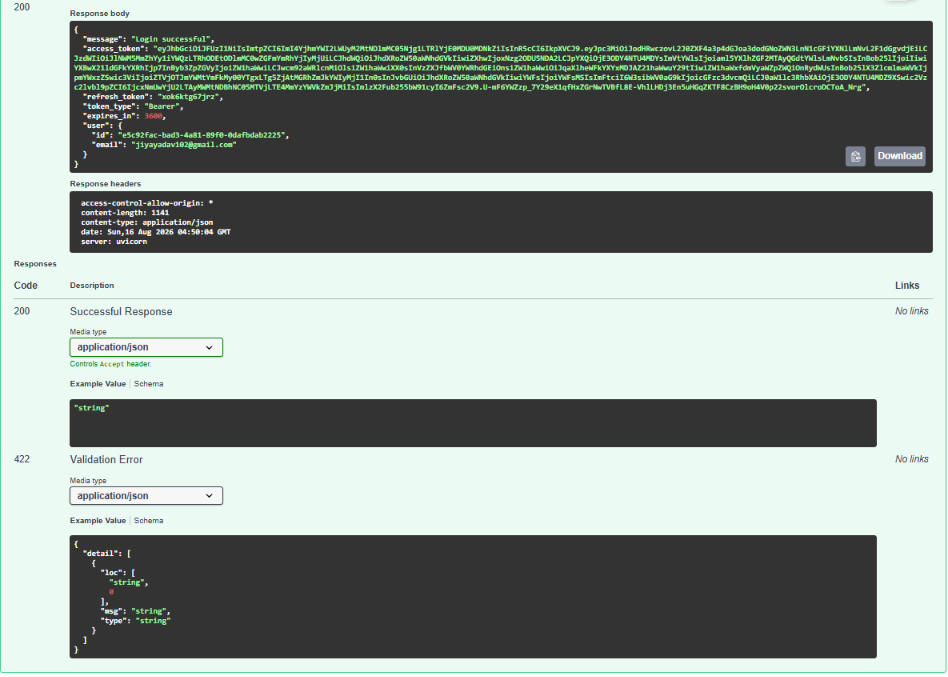
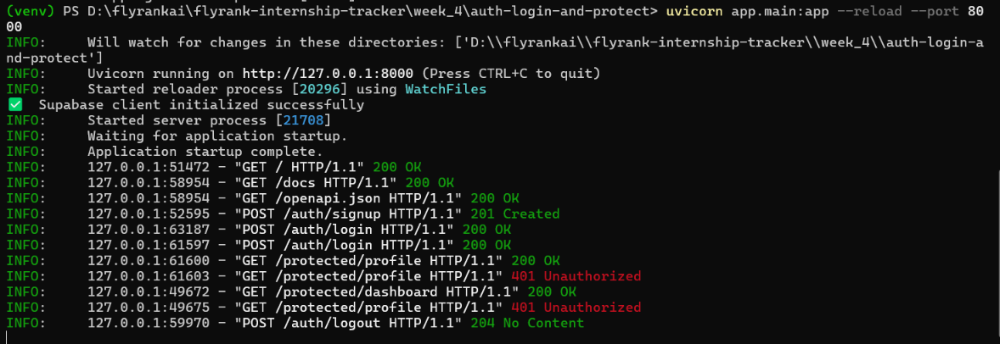
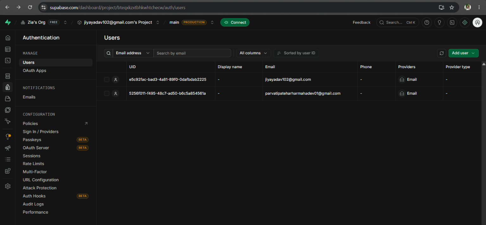

# FlyRank Auth API

> Secure authentication REST API built with **FastAPI** and **Supabase Auth** —
> implementing JWT-based sign-up, login, logout, and role-aware protected routes.
> Built as Assignment A4 of the FlyRank Backend Engineering Internship (Week 4).


---

## Table of Contents

- [Overview](#overview)
- [Architecture](#architecture)
- [Tech Stack](#tech-stack)
- [Project Structure](#project-structure)
- [Getting Started](#getting-started)
- [API Reference](#api-reference)
- [Authentication Flow](#authentication-flow)
- [Status Codes](#status-codes)
- [Security Design](#security-design)
- [Testing](#testing)
- [Swagger UI](#swagger-ui)
- [AI vs Me — Stage 7](#ai-vs-me--stage-7)
- [Commit History](#commit-history)
- [Deliverables Checklist](#deliverables-checklist)
- [Glossary](#glossary)

---

## Overview

Most beginner APIs are wide open — anyone with the URL can read, write,
or delete data. This project closes those doors.

It implements a complete **authentication layer** using
[Supabase Auth](https://supabase.com/docs/guides/auth) as the Identity Provider:

- Users register and log in via Supabase — passwords are **never stored or hashed by this server**
- Supabase returns a signed **JWT (access token)** on successful login
- Every protected route verifies that JWT via a single reusable `require_auth` dependency
- One middleware function guards every locked door — no copy-paste, no missed endpoints

The result is the foundation every real backend needs before it can serve
user-specific data: a verified `current_user` object available in any route handler.

---

## Architecture

```
┌─────────────┐ credentials ┌──────────────────┐ sign_up / sign_in ┌──────────────┐
│ │────────────►│ │──────────────────►│ │
│ Client │ │ FastAPI Server │ │ Supabase │
│ │◄────────────│ │◄──────────────────│ Auth │
└─────────────┘ JWT token └──────────────────┘ session + JWT └──────────────┘
│ │
│ Authorization: │ get_user(token)
│ Bearer <JWT> │─────────────────────────────────────────►
│ │◄─────────────────────────────────────────
│◄───────────────────────│ verified user / 401

```

**Trust triangle:** the client never touches the database directly.
Supabase owns credentials and token signing. This server owns
route logic and authorization rules.

---

## Tech Stack

| Layer | Technology |
|-------|-----------|
| Language | Python 3.11 |
| Framework | FastAPI 0.111.0 |
| Identity Provider | Supabase Auth |
| Auth SDK | `supabase` 2.5.0 (PyPI) |
| Data validation | Pydantic v2 |
| Server | Uvicorn (ASGI) |
| API Docs | Swagger UI — built into FastAPI at `/docs` |
| Secrets | `python-dotenv` |

---

## Project Structure
```
flyrank-auth-api/
├── app/
│ ├── init.py
│ ├── main.py # App factory — registers routers, CORS, Swagger metadata
│ ├── config.py # Supabase client init — reads .env, fail-fast on missing keys
│ ├── middleware/
│ │ ├── init.py
│ │ └── auth.py # require_auth — single reusable JWT verification dependency
│ └── routes/
│ ├── init.py
│ ├── auth.py # POST /auth/signup /login /logout /refresh
│ ├── protected.py # GET /protected/profile /dashboard /admin
│ └── public.py # GET /public/info
├── ai-version/
│ ├── main.py # Claude-generated version of the same API
│ └── .env.example
│ └── README-ai-vs-me.md # Diff analysis — AI output vs hand-built version
├── screenshots
│ ├── subapass_dashboard.png
│ └── swagger-authorized.png
│ └── swagger-screenshot.png
│ └── swagger-authorized2.png
│ └── success-code.png
│ └── swagger_signup1.png
│ └── swagger_signup2.png
├── .env # ← git-ignored | your real secrets live here
├── .env.example # ← committed | key names with placeholder values
├── .gitignore
├── requirements.txt
└── README.md
```

## Getting Started

### Prerequisites

- Python 3.10 or higher
- A free [Supabase](https://supabase.com) account and project
- Git

### 1 — Clone

```bash
git clone https://github.com/JIYA-YDV/flyrank-internship-tracker.git
cd week_4/auth-login-and-protect
```
### 2 — Virtual environment
```
python -m venv venv
.\venv\Scripts\Activate.ps1
```
If execution policy blocks activation:
```
Set-ExecutionPolicy -ExecutionPolicy RemoteSigned -Scope CurrentUser
```
### 3 — Install dependencies
```
pip install -r requirements.txt
```
### 4 — Environment variables
```
Copy-Item ".env.example" ".env"
notepad .env
env
```
SUPABASE_URL=https://your-project-ref.supabase.co
SUPABASE_KEY=your-anon-public-key-here

### Where to find these values:
-Open supabase.com → your project
-Navigate to Settings → API
-Copy Project URL → SUPABASE_URL
-Copy anon / public key → SUPABASE_KEY

⚠️ Never use the service_role key. It bypasses Row Level Security
and gives unrestricted database access. The anon key is the correct
choice for application code.

### 5 — One-time Supabase configuration
Disable email confirmation so test accounts can log in immediately:

Supabase Dashboard
  → Authentication
  → Providers
  → Email
  → Toggle OFF "Confirm email"
  → Save
In production leave this ON — email confirmation is a real security feature.

### 6 — Run
```
uvicorn app.main:app --reload --port 8000
```
Expected output:

✅  Supabase client initialized successfully

INFO:     Uvicorn running on http://127.0.0.1:8000 (Press CTRL+C to quit)

INFO:     Application startup complete.

| Interface |	URL |
|-----------|-----|
| API root	| http://localhost:8000 |
| Swagger UI| http://localhost:8000/docs |
| ReDoc |	http://localhost:8000/redoc |

### API Reference
| Method	| Endpoint| Auth| Description |	Status |
|---------|---------|------|------------|--------|
| GET |	/ |	— |	Health check | 200
| GET |	/public/info |	— |	Public endpoint, no token needed	| 200
| POST | /auth/signup | —	 |Register a new user account |	201
| POST |	/auth/login |	— |	Authenticate and receive a JWT |	200
| POST |	/auth/logout |	🔒 Bearer |	Invalidate the current session |	204
| POST |	/auth/refresh |	— | Exchange refresh token for new access token |	200
| GET |	/protected/profile |	🔒 Bearer |	Fetch authenticated user's profile |	200
| GET |	/protected/dashboard |	🔒 Bearer |	Fetch authenticated user's dashboard |	200
| GET |	/protected/admin |	🔒 Bearer + admin	 | Admin-only resource (demonstrates 403) |	200

### Request / Response examples

#POST /auth/signup

- Request body
{ "email": "user@example.com", "password": "password123" }

- 201 Created
{
  "message": "Account created successfully",
  "user": {
    "id": "8aeb72ac-a6bf-4e69-8980-6e20fb6f5324",
    "email": "user@example.com",
    "created_at": "2025-01-01T00:00:00+00:00"
  }

#POST /auth/login

- Request body
{ "email": "user@example.com", "password": "password123" }

- 200 OK
{
  "message": "Login successful",
  "access_token": "eyJhbGciOiJFUzI1NiIs...",
  "refresh_token": "hnrrexreek4e...",
  "token_type": "Bearer",
  "expires_in": 3600
}

# GET /protected/profile — Authorization: Bearer <token>


- 200 OK
{
  "message": "Welcome to your private profile",
  "user": {
    "id": "8aeb72ac-a6bf-4e69-8980-6e20fb6f5324",
    "email": "user@example.com",
    "created_at": "2025-01-01T00:00:00+00:00",
    "last_sign_in_at": "2025-01-02T10:00:00+00:00"
  }
}

- 401 Unauthorized (missing token)
{ "detail": "Access token required" }

- 401 Unauthorized (invalid/expired token)
{ "detail": "Invalid or expired token" }

### Authentication Flow
```
Client                  FastAPI Server               Supabase Auth
  │                           │                            │
  │                           │                            │
  │──── POST /auth/signup ───►│                            │
  │     { email, password }   │──── sign_up() ────────────►│
  │                           │                            │  hash password
  │◄─── 201 { user }  ────────│◄─── { user } ─────────────│  store account
  │                           │                            │
  │                           │                            │
  │──── POST /auth/login ────►│                            │
  │     { email, password }   │──── sign_in_with_      ───►│
  │                           │     password()             │  verify hash
  │◄─── 200 { access_token } ─│◄─── { session + JWT } ─────│  issue JWT
  │                           │                            │
  │                           │                            │
  │──── GET /protected/    ──►│                            │
  │     profile               │                            │
  │     Authorization:        │──── get_user(token) ──────►│
  │     Bearer <JWT>          │                            │  verify signature
  │                           │◄─── { verified user } ─────│  check expiry
  │◄─── 200 { profile } ──────│                            │
  │                           │                            │
  │                           │                            │
  │──── POST /auth/logout ───►│                            │
  │     Authorization:        │──── sign_out() ───────────►│
  │     Bearer <JWT>          │                            │  revoke refresh token
  │◄─── 204 No Content ───────│                            │
  │                           │                            │
```
### Status Codes

| Code |	Text |	When returned |
|------|-------|----------------|
|200 |	OK |	Successful read, login, or token refresh |
|201 |	Created |	Successful account registration |
|204 |	No Content |	Successful logout — intentionally empty body |
|400 |	Bad Request | Missing fields, password too short, duplicate email |
|401 |	Unauthorized |	Missing token, malformed token, expired token |
|403 |	Forbidden |	Valid token but insufficient permissions |
|422 |	Unprocessable | Entity	Pydantic validation failure — wrong field types |

# 401 vs 403 — critical distinction
- 401 Unauthorized  →  "Who are you?"
                      The server cannot identify the caller.
                      Cause:  no token / bad token / expired token
                      Fix:    log in again → POST /auth/login

- 403 Forbidden     →  "I know exactly who you are — and still no."
                      The server identified the caller but they lack permission.
                      Cause:  authenticated as a regular user on an admin route
                      Fix:    requires elevated privileges, not a new token
                      
This distinction matters: returning 403 where 401 is correct leaks
that an endpoint exists and requires a specific role — an information
disclosure vulnerability.

### Security Design

| Decision | Rationale |
|----------|-----------|
| Passwords never stored or hashed by this server |	Supabase handles bcrypt — writing your own crypto is how security incidents happen |
| anon key only, service_role never in app code |	service_role bypasses RLS entirely — treat it like a root database password |
| Token verified via get_user(token) network call |	Local JWT decoding cannot detect revoked sessions — only the IdP can |
| Single require_auth dependency via Depends() |	One fix propagates to every protected route — no missed endpoints from copy-paste |
| Generic 401 message regardless of failure reason |	Prevents user enumeration — attacker cannot distinguish "wrong password" from "no account" |
| try/except wrapping all Supabase SDK calls | Supabase Python SDK v2 raises exceptions on auth failure, not silent None returns |
| WWW-Authenticate: Bearer on all 401 responses	| RFC 7235 compliance — tells clients the correct auth scheme |
| Fail-fast startup validation on env vars |	RuntimeError before the app accepts any request — no silent misconfiguration |

### Testing
PowerShell — full auth flow

# ── 1. Sign up 
```
Invoke-RestMethod `
  -Uri         "http://localhost:8000/auth/signup" `
  -Method      POST `
  -ContentType "application/json" `
  -Body        '{"email":"test@example.com","password":"password123"}'
```
# ── 2. Log in and capture token
```
$response = Invoke-RestMethod `
  -Uri         "http://localhost:8000/auth/login" `
  -Method      POST `
  -ContentType "application/json" `
  -Body        '{"email":"test@example.com","password":"password123"}'

$response = Invoke-RestMethod -Uri "http://localhost:8000/auth/login" -Method POST -ContentType "application/json" -Body '{"email":"your_email","password":"your_password"}'
$TOKEN = $response.access_token
```
# ── 3. Access protected profile — valid token → 200
```
Invoke-RestMethod `
  -Uri     "http://localhost:8000/protected/profile" `
  -Method  GET `
  -Headers @{ Authorization = "Bearer $TOKEN" }
```
# ── 4. Tampered token → 401
```
try {
    Invoke-RestMethod `
      -Uri     "http://localhost:8000/protected/profile" `
      -Method  GET `
      -Headers @{ Authorization = "Bearer ${TOKEN}TAMPERED" }
} catch {
    Write-Host "Correctly rejected — $($_.Exception.Response.StatusCode)"
}
```
# ── 5. No token → 401
```
try {
    Invoke-RestMethod -Uri "http://localhost:8000/protected/profile" -Method GET
} catch {
    Write-Host "Correctly rejected — $($_.Exception.Response.StatusCode)"
}
```
# ── 6. Logout → 204
```
try {
    Invoke-RestMethod `
      -Uri     "http://localhost:8000/auth/logout" `
      -Method  POST `
      -Headers @{ Authorization = "Bearer $TOKEN" }
} catch {
    if ($_.Exception.Response.StatusCode.value__ -eq 204) {
        Write-Host "Logout successful — 204 No Content"
    }
}
```

### Expected results 

|Test	| Expected |
|-----|----------|
|Signup new account	| 201 + user object|
|Login with correct credentials |	200 + access_token|
|Profile with valid token |	200 + user profile|
|Profile with tampered token |	401 + "Invalid or expired token"|
|Profile with no token |	401 + "Access token required"|
|Logout with valid token | 204 No Content |

### Swagger UI

FastAPI generates interactive API documentation automatically at /docs.

# Using the Authorize padlock

1. Open http://localhost:8000/docs
2. Execute POST /auth/login → copy the access_token value
3. Click the Authorize 🔒 button (top-right of the page)
4. Paste your token into the Value field → click Authorize → Close
5. All 🔒 routes now send your token automatically
6. Execute GET /protected/profile → observe 200 with your user data

### Screenshots

* **Swagger UI showing lock icons on protected routes:**


* **Successful authorized request — 200 response:**



* **Success code:**
  
 
  
* **Supabase Dashboard:**



### AI vs Me — Stage 7
- My prompt
```
Build a secure REST API using Python and FastAPI with Supabase as the
Identity Provider.

Use these packages: fastapi, uvicorn, supabase (PyPI), python-dotenv, pydantic.

Create exactly these 5 routes:
  - POST /auth/signup       — 201 on success, 400 if password < 6 chars
  - POST /auth/login        — 200 + access_token on success, 401 on bad credentials
  - POST /auth/logout       — protected, 204 No Content
  - GET  /protected/profile — protected, return verified user id/email/created_at
  - GET  /public/info       — no auth, 200 with welcome message

Write a reusable FastAPI dependency called require_auth that:
  - Uses HTTPBearer(auto_error=False)
  - Returns 401 "Access token required" if header missing
  - Calls supabase.auth.get_user(token) wrapped in try/except
  - Returns 401 "Invalid or expired token" on failure
  - Returns { id, email, created_at, last_sign_in_at } on success

Load SUPABASE_URL and SUPABASE_KEY from .env.

Raise RuntimeError at startup if either is missing.

Everything in a single main.py.
```
# Did the AI code run?

Claude ran the code internally using TestClient with dummy env vars and confirmed:
- Startup RuntimeError fires correctly on missing keys
- All 5 routes register with correct paths and methods
- 401 returned with no Authorization header
- 401 returned with an invalid token string
- 400 returned for passwords under 6 characters
- 200 returned from /public/info without any token
  
What Claude did not do: run against a real Supabase project.
All tests used mocked responses — no live network calls were made.
My version was tested against a real Supabase project throughout development.

# Difference 1 — Token extraction and RFC compliance
Claude wrote:
```
def require_auth(
    credentials: Optional[HTTPAuthorizationCredentials] = Security(bearer_scheme),
) -> dict:
    if credentials is None or not credentials.credentials:
        raise HTTPException(
            status_code=status.HTTP_401_UNAUTHORIZED,
            detail="Access token required",
        )
```

I wrote:

```
def require_auth(
    credentials: HTTPAuthorizationCredentials | None = Depends(bearer_scheme),
) -> dict:
    if credentials is None:
        raise HTTPException(
            status_code=status.HTTP_401_UNAUTHORIZED,
            detail="Access token required",
            headers={"WWW-Authenticate": "Bearer"},   # RFC 7235 compliance
        )
    token = credentials.credentials
    if not token:
        raise HTTPException(
            status_code=status.HTTP_401_UNAUTHORIZED,
            detail="Access token required — token is empty",
            headers={"WWW-Authenticate": "Bearer"},
        )
```
-Analysis:
Claude used Security() which is semantically more correct for auth
dependencies in FastAPI — point to Claude. However Claude omitted the
WWW-Authenticate: Bearer response header required by
RFC 7235 §4.1.
This header tells clients the authentication scheme to use.
My version is spec-compliant. Claude's is not.

# Difference 2 — Startup validation
Claude wrote:

```
SUPABASE_URL: Optional[str] = os.environ.get("SUPABASE_URL")
SUPABASE_KEY: Optional[str] = os.environ.get("SUPABASE_KEY")

if not SUPABASE_URL or not SUPABASE_KEY:
    raise RuntimeError("SUPABASE_URL and SUPABASE_KEY must be set...")

supabase: Client = create_client(SUPABASE_URL, SUPABASE_KEY)
```

I wrote:

```
SUPABASE_URL: str = os.environ.get("SUPABASE_URL", "")
SUPABASE_KEY: str = os.environ.get("SUPABASE_KEY", "")

if not SUPABASE_URL or not SUPABASE_KEY:
    raise RuntimeError(
        "\n❌  SUPABASE_URL and SUPABASE_KEY must be set in your .env file.\n"
        "    Copy .env.example to .env and fill in your Supabase project values.\n"
    )

supabase: Client = create_client(SUPABASE_URL, SUPABASE_KEY)
```
-Analysis:
The validation logic is identical — both fail fast, both raise RuntimeError.
Claude's Optional[str] type hint is technically more accurate since
os.environ.get() can return None. Mine defaults to "" which
avoids None but changes the type. Practically the result is the same.
This is a style difference, not a correctness difference.

# Difference 3 — Production None safety on Supabase fields

Claude wrote:
```
# login response
return {
    "access_token": session.access_token,
    "refresh_token": session.refresh_token,
    "token_type": "bearer",           # ← lowercase — violates RFC 6750
    "expires_in": session.expires_in, # ← no None guard
}

# require_auth return value
return {
    "id": user.id,
    "email": user.email,
    "created_at": user.created_at,           # ← no str() serialization
    "last_sign_in_at": user.last_sign_in_at, # ← None for new accounts
}
```
I wrote:

```
# login response
return {
    "access_token":  session.access_token,
    "refresh_token": session.refresh_token,
    "token_type":    "Bearer",  # RFC 6750 capitalisation
    "expires_in":    session.expires_in if session.expires_in is not None else 3600,
}

# require_auth return value
return {
    "id":              str(user.id) if user.id else None,
    "email":           user.email or None,
    "created_at":      str(user.created_at) if user.created_at else None,
    "last_sign_in_at": str(user.last_sign_in_at) if user.last_sign_in_at else None,
}
```

Analysis:
This is the most consequential difference and the one most likely to
cause a production incident.

Claude's version crashes with an HTTP 500 in two documented real-world scenarios:

1. session.expires_in is None — observed on certain Supabase SDK
versions. FastAPI's JSON serializer raises a TypeError on None in
a field typed as int.

2. user.last_sign_in_at is None — guaranteed on brand-new accounts
that have never completed a login. Claude's version returns a 500 on
the first login of a new account.

I discovered both of these by running against a real Supabase project
during Stage 1 testing. Claude's mock-only testing environment hid both bugs.

This is the production gap that unit tests cannot close.

# What my prompt forgot to specify

| Omission |	Consequence |
|----------|--------------|
|Did not specify folder structure |	Claude put everything in one main.py — fine for a demo, unacceptable for a real project |
| Did not say "guard against None fields" |	Claude returned raw SDK values — crashes in production on new accounts |
| Did not specify token_type casing	| Claude returned "bearer" — RFC 6750 requires "Bearer" |
| Did not mention WWW-Authenticate header	| Claude omitted it — RFC 7235 non-compliance |

### Improved prompt (second attempt)

Added to the prompt:

Structure the project as: config.py (Supabase init), middleware/auth.py
(require_auth), routes/auth.py, routes/protected.py, routes/public.py.

Guard against None on all Supabase response fields — session.expires_in,
user.last_sign_in_at, and user.created_at can all be None in real SDK responses.
Use `value if value is not None else default`.

Return token_type as "Bearer" with capital B per RFC 6750.
Include headers={"WWW-Authenticate": "Bearer"} on all 401 responses per RFC 7235.

Result: regenerated output matched my production version in structure,
None safety, and RFC compliance. First run against a real Supabase project
produced zero 500 errors.

### Key lesson

The AI's output is exactly as good as the specification —
and you can only judge the output if you built the thing yourself first.

Claude's code looks correct. It passes its own tests.
It fails in production on the first new-account login.

I caught this because I personally debugged a 500 on session.expires_in
during my own Stage 1 testing — a bug invisible in mocked tests but
immediate against a real Supabase project.

That is the entire point of building before prompting.

* **Commits : 12+**

### Deliverables Checklist 

- Core requirements

✅ Server starts with a single command — uvicorn app.main:app --reload --port 8000

✅ .env is git-ignored — Supabase keys never reach GitHub

✅ .env.example committed with placeholder values

✅ POST /auth/signup communicates with Supabase Auth — returns 201

✅ POST /auth/login communicates with Supabase Auth — returns 200 + JWT

✅ GET /protected/profile extracts and verifies Bearer token — returns 200

✅ Correct status codes throughout: 201 · 200 · 204 · 400 · 401 · 403 · 422

✅ require_auth extracted as a reusable FastAPI dependency via Depends()

✅ Applied to POST /auth/logout, GET /protected/profile, GET /protected/dashboard

✅ Swagger UI at /docs with 🔒 padlock on all protected routes

✅ Public GitHub repository with ≥ 12 commits

✅ README with setup instructions, run command, and endpoint reference table

- Stretch goals

✅ GET /protected/admin — 403 Forbidden for non-admin users

✅ 401 vs 403 distinction documented with examples

✅ POST /auth/refresh — refresh token endpoint with explanation of short-lived tokens

- Bonus — Stage 7

✅ AI-generated version in ai-version/main.py

✅ Diff analysis in ai-version/README-ai-vs-me.md

✅ Three concrete differences identified with code examples

✅ Improved prompt documented with before/after comparison

### Glossary

| Term | Definition |
|------|------------|
| JWT (JSON Web Token) |	A cryptographically signed compact string encoding claims like user ID and expiry. Cannot be tampered with — altering one character invalidates the signature.|
| Access token |	The short-lived JWT returned by /auth/login. Sent in the Authorization header on every protected request. Default expiry: 1 hour.|
| Refresh token |	A long-lived token used to obtain a new access token without re-authentication. Sent once to /auth/refresh, not on every request.|
| Bearer token |	An access token presented in the format Authorization: Bearer <token>. The server grants access to whoever "bears" it.|
| Identity Provider (IdP) |	An external service (Supabase here) that owns user accounts, hashes passwords, and issues signed tokens. Your server delegates trust to the IdP.|
| require_auth |	The FastAPI dependency that runs before any protected route handler. Extracts the token, verifies it with Supabase, attaches the user, or raises 401.|
| Depends() |	FastAPI's dependency injection mechanism. Declaring current_user: dict = Depends(require_auth) runs require_auth before the route handler.
| 401 Unauthorized |	The caller cannot be identified — token missing, malformed, or expired. Fix: log in again.
| 403 Forbidden |	The caller is identified but not permitted — valid token, wrong role. Fix: requires elevated privileges.
| anon key |	Supabase's public API key. Respects Row Level Security. Safe to use in application code.
| service_role key |	Supabase's admin key. Bypasses all security. Must never appear in application code or be committed to version control.
| RLS (Row Level Security) |	Supabase database policy layer that restricts which rows a user can read or write based on their identity.
| Fail-fast |	Crashing immediately at startup when required configuration is missing — rather than running silently broken and failing on the first real request.

* **JIYA YADAV** * **FLYRANK AI** * **WEEK-4**
